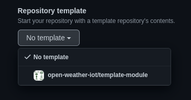
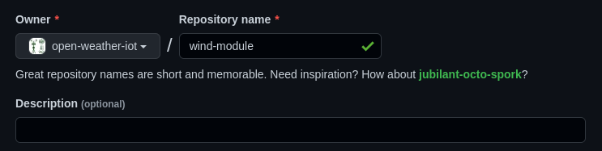

# TEMPLATE DE MÓDULO
Esse repositório é um template para um módulo de sensor.

## Utilizando esse template
Para criar um novo módulo, siga os seguintes passos:
- Crie um repositório no GitHub nesta organização (`open-weather-iot`)
- Selecione o template `template-module`


- Dê um nome no formato `{sensor}-module`. Exemplo: `temperature-module`


- Não é necessário escrever uma descrição
- Deixe o projeto público. **Não faça upload de nenhum arquivo com informações sensíveis**


Após a inicialização do repositório:
- Reescreva o arquivo README.md com a descrição do projeto, incluindo o que é, informações necessárias, detalhes de execução e o restante que julgar pertinente.
- Inclua os arquivos necessários nas pastas descritas em na seção seguinte ([Organização de pastas e arquivos](#organizacao))

## Organização de pastas e arquivos <a id="organizacao"></a>
- `altium/`: arquivos do Altium
- `documents/`: especificações e PDFs utilizados para o desenvolvimento do sub-projeto
- `gerber_files/`: export de arquivos Gerber
- `img/`: imagens utilizadas na descrição do README.md
- `src/`: diretório do código-fonte. Todo código deverá ser colocado aqui, exceto quando é utilizado exclusivamente para testes
  - `__init__.py`: arquivo vazio para o Python reconhecer um módulo
  - `example.py`: módulo de sensor exemplo
- `test/`: diretório com os arquivos para execução de testes
  - `main.py`: arquivo principal da rotina de execução de testes. Importa as classes e funções do diretório do código-fonte (`src/`)

Os arquivos `.gitkeep` existem nas pastas vazias para que elas sejam reconhecidas pelo git e incluídas no template. Após popular seu conteúdo, esses arquivos devem ser removidos.

## Base para uma classe de sensor
A base para um sensor é uma classe, a qual na inicialização deve receber como parâmetros nomeados as conexões (pinos) e conter um método (função) chamado `read()` que retorna a leitura em determinado momento.

O método `read()` retorna um dicionário com as seguintes chaves:
- `raw`: contém um dicionário com os valores puros que foram lidos do sensor que se está trabalhando
- `value`: representa o valor final após conversão de unidades para ser apresentado diretamente ao usuário
- `unit`: unidade de medida do campo `value`. Exemplo: `'Celsius'`

```py
class Example:
    # deve receber como parâmetros os pinos em que o sensor deverá se conectar
    def __init__(self, *, enable_pin, tx_pin, rx_pin):
        pass

    # método obrigatório da classe que realiza leituras do sensor
    def read(self):
        return { 'raw': {}, 'value': 0.0, 'unit': '' }
````

## Orientações gerais
### Import
Não importe o módulo inteiro.
> ❌ 
> ```py
> from example import *
> ````

> ✅ 
> ```py
> from example import Example
> ````

---

### Identação
Tome cuidado para identar o código com **4 espaços**.
> ❌ Exemplo: 3 espaços
> ```py
> def test():
>    return 42
> ```

> ✅
> ```py
> def test():
>     return 42
> ```

---

### Parâmetros nomeados
Quando uma classe ou função tem objetivo de comunicar com o usuário final, dê preferência a receber e passar parâmetros pelo nome, em vez de pela ordem de passagem de parâmetros.

Essa recomendação propõe que os nomes dos parâmetros sejam expostos ao usuário da classe ou função, assim, facilitando a leitura dos parâmetros sem a necessidade de abrir o código e analisar a ordem dos parâmetros.

> ❌
> ```py
> class Example:
>     # Inicialização da classe Example
>     # recebe os pinos utilizados para o SPI
>     def __init__(self, clk_pin, sdi_tx_pin, sdo_rx_pin, cs_pin, spi_id):
>         pass
>
> # ...
> 
> ex = Example(10, 11, 12, 13, 1)
> ```

> ✅
> ```py
> class Example:
>     # Inicialização da classe Example
>     # recebe os pinos utilizados para o SPI
>     def __init__(self, *, clk_pin, sdi_tx_pin, sdo_rx_pin, cs_pin, spi_id):
>         pass
>
> # ...
> 
> ex = Example(clk_pin=10, sdi_tx_pin=11, sdo_rx_pin=12, cs_pin=13, spi_id=1)
> ```

> 💡 Note que basta colocar `*` na posição a partir da qual deseja-se que os parâmetros seguintes sejam passados pelo nome, não por ordem

---

### Parâmetros de inicialização de classes
Valores padrão podem ser utilizados para parâmetros que definam comportamentos do módulo/função. Porém, não utilize valores padrão quando se refere ao hardware (por exemplo, um pino).

Essa recomendação facilita no momento de integração de códigos e resolução de conflito de pinagem.

> ❌
> ```py
> class Example:
>     # Inicialização da classe Example
>     # recebe os pinos utilizados para o SPI
>     def __init__(self, *, clk_pin=10, sdi_tx_pin=11, sdo_rx_pin=12, cs_pin=13, spi_id=1):
>         pass
> ```

> ✅
> ```py
> class Example:
>     # Inicialização da classe Example
>     # recebe os pinos utilizados para o SPI
>     def __init__(self, *, clk_pin, sdi_tx_pin, sdo_rx_pin, cs_pin, spi_id):
>         pass
> ```

> ✅
> ```py
> # interval: intervalo de envio de dados (em segundos)
> def send(interval=10):
>     pass
> ```
